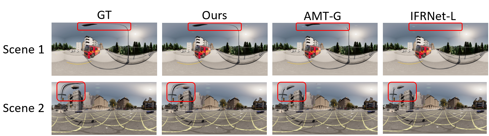
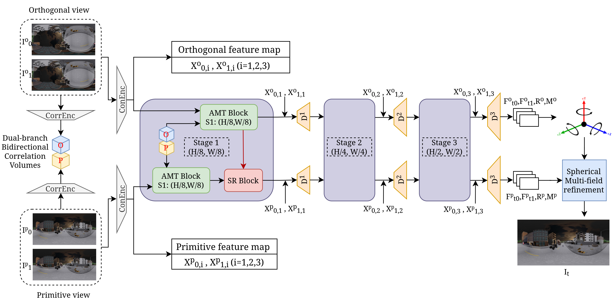

# SVI360: Spherical Video Interpolation

[](https://icb-vision-ai.github.io/video360_interpolation/)
[](https://arxiv.org/pdf/2607.11710)
[](#license)

Official PyTorch implementation of **SVI360: Spherical Video Interpolation**.

SVI360 is designed for video frame interpolation in omnidirectional videos. Standard perspective-frame interpolation methods often struggle near the poles because of strong spherical distortions and non-uniform pixel density. SVI360 addresses this by processing both the original spherical frame and a rotated orthogonal view, then using cross-view spherical refinement to improve optical flow estimation and intermediate-frame synthesis.

Project page: [https://icb-vision-ai.github.io/video360_interpolation/](https://icb-vision-ai.github.io/video360_interpolation/)

Qualitative results show that perspective-frame interpolation methods struggle on spherical frames, especially near the poles where distortions are stronger, while our method handles these regions better.



## Overview



Given two input spherical frames, SVI360 predicts an intermediate frame at a target timestamp. The model uses a dual-branch architecture:

- The **primitive branch** processes the original equirectangular view.
- The **orthogonal branch** processes a 90-degree rotated view, where regions near the poles are moved closer to the image center.
- The **spherical refiner** transfers motion and feature cues from the orthogonal branch back to the primitive branch.
- A **spherical multi-field refinement** module fuses branch outputs to synthesize the final interpolated frame.

The training objective includes a spherical weighted reconstruction loss that accounts for the non-uniform sampling density of equirectangular images.

## Highlights

- Video frame interpolation for omnidirectional videos.
- Dual primitive/orthogonal branch design for better handling of polar distortion.
- Cross-view spherical refinement of optical flow and intermediate features.
- Support for middle-frame and arbitrary-timestep interpolation.
- Evaluation utilities for image-quality and spherical optical-flow metrics.
- Pretrained model support and demo scripts for image pairs and frame sequences.

## Installation

Clone the repository and install the required dependencies:

```bash
git clone https://github.com/ICB-Vision-AI/video360_interpolation.git
cd video360_interpolation
conda create -n svi360 python=3.9
conda activate svi360

# Install PyTorch and torchvision for your CUDA/ROCm/CPU setup:
# https://pytorch.org/get-started/locally/

pip install -r requirements.txt

# Create folder to contain pretrained model
mkdir checkpoints
```

The code is implemented in PyTorch and is intended to run with CUDA-enabled GPUs. Install `torch` and `torchvision` separately according to your hardware setup, CUDA/ROCm version, or CPU-only environment. The code was tested with `torch==2.4.0` and `torchvision==0.19.0`.

## Pretrained Models

Pretrained models can be downloaded here.

| Model | Training data | Checkpoint |
| --- | --- | --- |
| SVI360 | FlowScape | [OneDrive](https://1drv.ms/u/c/546ebb34c1ce2d67/IQDPJxdLxaYZQrXN7C_Iy1IVAQb4HLB5BPrAOT7USQ82H8E?e=fWGK9O) |
| SVI360 | Flow360 | TODO |
| SVI360 | ODV360 | [OneDrive](https://1drv.ms/u/c/546ebb34c1ce2d67/IQAPS31_K_6gTpZhB8CnAQPkAR3GaQI9H20cmxXrjyMCV5g?e=1vRJb5) |
| Lite SVI360 | FlowScape | [OneDrive](https://1drv.ms/u/c/546ebb34c1ce2d67/IQC8oyzadFcWSbwEibKWCHR9AS4eiZRVnXy9IYZNFdmQHVE?e=y5UbGW) |

After downloading checkpoints, place them under `checkpoints/` or update the paths in the commands below.

## Quick tests

Run demo1 with the FlowScape checkpoint:

```bash
python demos/demo_2x.py \
  --config cfgs/flowscape_middle_frame.yaml \
  --ckpt checkpoints/svi360_flowscape.pth \
  --img0 assets/demo1/img0.png \
  --img1 assets/demo1/img1.png \
  --out_path results/demo1
```

Compare `results/demo1/imgt_pred_1.png` with `assets/demo1_gt_middle_frame.jpg`.

Run demo2 with the ODV360 checkpoint:

```bash
python demos/demo_recursive.py \
  --config cfgs/odv360_middle_frame.yaml \
  --ckpt checkpoints/svi360_odv360.pth \
  --input_dir assets/demo2 \
  --output_images results/demo2 \
  --num_frames 7
```

## Datasets

SVI360 is evaluated on public omnidirectional video and optical-flow benchmarks. Please cite the corresponding dataset papers when using them:

- **FlowScape**: H.Shi et al., *PanoFlow: Learning 360-degree Optical Flow for Surrounding Temporal Understanding*, IEEE Trans. Intell. Transp. Syst., vol. 24, no. 5, pp. 5570–5585, 2023.
- **Flow360**: Bhandari et al., *Learning Omnidirectional Flow in 360-degree Video via Siamese Representation*, ECCV 2022.
- **ODV360**: Cao et al., *NTIRE 2023 Challenge on 360deg Omnidirectional Image and Video Super-Resolution: Datasets, Methods and Results*, CVPR Workshops 2023.
- **360VFI**: Lu et al., *360VFI: A Dataset and Benchmark for Omnidirectional Video Frame Interpolation*, 2024.

Dataset access:

- **FlowScape**: [Google Drive](https://drive.google.com/file/d/1CJuAvdq0uk1EudPD47QXaIy4cg7Jqn_e/view)
- **Flow360**: [Project page](https://siamlof.github.io/)
- **ODV360**: [Download](https://1drv.ms/u/c/546ebb34c1ce2d67/IQBs-pBDBNR1QacYlezVDaviAebhbVfSzFsr2qCSNxac7UM?e=Kh3tY4)
- **360VFI**: please ask the paper authors for permission.

Original dataset layouts:

```text
FlowScape/
  train|test/
    sunny|cloud|fog|rain/
      img/<sequence>/000000.jpg ...
      flow/<sequence>/000000.flo ...
      valid/<sequence>/000000.jpg ...
      flow_viz/<sequence>/...
      semantic/<sequence>/...
```

```text
flow360/
  train|test/
    <scene_id>/                  # e.g. 000, 001, ...
      frames/0001.png ...
      fflows/0001.npy ...
      bflows/0001.npy ...
```

```text
ODV360/
  train|val|test/
    /<sequence>/0000.png ...
```

For ODV360, this project focuses on LR images rather than HR images, so the HR images were deleted from the local dataset copy.

The dataloaders expect Vimeo-style triplet or nonuplet directory structures, so the original datasets are first converted into a Vimeo-style structure. When converting ODV360 to Vimeo-style triplets, images are resized from 540x270 to 512x256 so models with up to 8x spatial downsampling do not suffer from shape-mismatch issues.

Converted dataset layout:

```text
<converted_dataset>/
  sequences/
    train|test|val/
      <sample_id>/im1.png
      <sample_id>/...
      <sample_id>/imN.png

  tri_trainlist.txt (if N=3) or non_trainlist.txt (if N=9)
  tri_testlist.txt (if N=3) or non_testlist.txt (if N=9)
```

Conversion utilities are provided in `scripts/`:

```bash
python scripts/convert_flowscape_to_vimeoStyleTriplet.py
python scripts/convert_odv360_to_vimeoStyleTriplet.py
python scripts/convert_flow360_to_vimeoStyle.py
```

Before running a conversion script, edit its input and output paths to match your local dataset locations.

## Inference

Use the FlowScape checkpoint for virtual scene inference and the ODV360 checkpoint for real scene inference.

**Note:** For inference, evaluation, or training, update the model configuration in the config file to choose between the SVI360 model and the Lite_SVI360 model.

### Middle-frame interpolation

Use `demos/demo_2x.py` to interpolate one middle frame between two input equirectangular images:

```bash
python demos/demo_2x.py \
  --config cfgs/flowscape_middle_frame.yaml \
  --ckpt checkpoints/flowscape.pth \
  --img0 path/to/frame_0.png \
  --img1 path/to/frame_1.png \
  --out_path results/demo_2x
```

The script writes the two input frames and the predicted middle frame to the output directory.

### Recursive sequence upsampling

Use `demos/demo_recursive.py` to recursively insert multiple intermediate frames between each pair of ordered input frames:

```bash
python demos/demo_recursive.py \
  --config cfgs/flowscape_middle_frame.yaml \
  --ckpt checkpoints/flowscape.pth \
  --input_dir path/to/input_frames \
  --output_images results/demo_recursive \
  --num_frames 7
```

`--num_frames` must be equal to `2**k - 1`, for example `1`, `3`, `7`, or `15`.

## Evaluation

### Middle-frame interpolation

```bash
python benchmarks/middle_frame_interpolation.py \
  --config cfgs/flowscape_middle_frame.yaml \
  --ckpt checkpoints/flowscape.pth \
  --out-json results/flowscape_middle_frame.json
```

This benchmark reports PSNR, SSIM, interpolation error, weighted spherical image metrics, and optical-flow metrics when ground-truth flow is available.

### Arbitrary-frame interpolation

```bash
python benchmarks/arbitrary_frame_interpolation.py \
  --config cfgs/flow360_arbitrary_frame.yaml \
  --ckpt checkpoints/flow360.pth \
  --out-json results/flow360_arbitrary_frame.json
```

## Training

Train a model from a configuration file:

```bash
python train.py --config cfgs/flowscape_middle_frame.yaml
```

For multi-GPU training, set `distributed=True` in the config file and use PyTorch distributed launch:

```bash
torchrun --nproc_per_node=4 train.py --config cfgs/flowscape_middle_frame.yaml
```

Checkpoints and logs are written to the directory specified by `save_dir` in the selected configuration file.

## Citation

```bibtex
@misc{nguyen2026svi360sphericalvideointerpolation,
      title={SVI360: Spherical Video Interpolation}, 
      author={Le-Kim Nguyen and Renato Martins and Pascal Vasseur and Cedric Demonceaux},
      year={2026},
      eprint={2607.11710},
      archivePrefix={arXiv},
      primaryClass={cs.CV},
      url={https://arxiv.org/abs/2607.11710}, 
}
```

## Acknowledgements

This work builds on prior research in video frame interpolation, spherical optical flow, and omnidirectional video understanding, including [AMT](https://github.com/MCG-NKU/AMT.git) and [PriOr-Flow](https://github.com/longliangLiu/PriOr-Flow.git). We sincerely thank the authors of [360VFI](https://arxiv.org/pdf/2407.14066) for generously sharing their dataset.

This work was funded by the project ANR TSIA DEVIN (ANR-23-IAS2-0001), ANER MOVIS from "Region Bourgogne-Franche-Comte" and ANR MANYVIS (ANR-23-CE23-0003-01), to whom we are grateful.

We thank the access to the HPC computational resources of IDRIS under the allocation AD011016829.

## License

This project is released under the MIT License.
